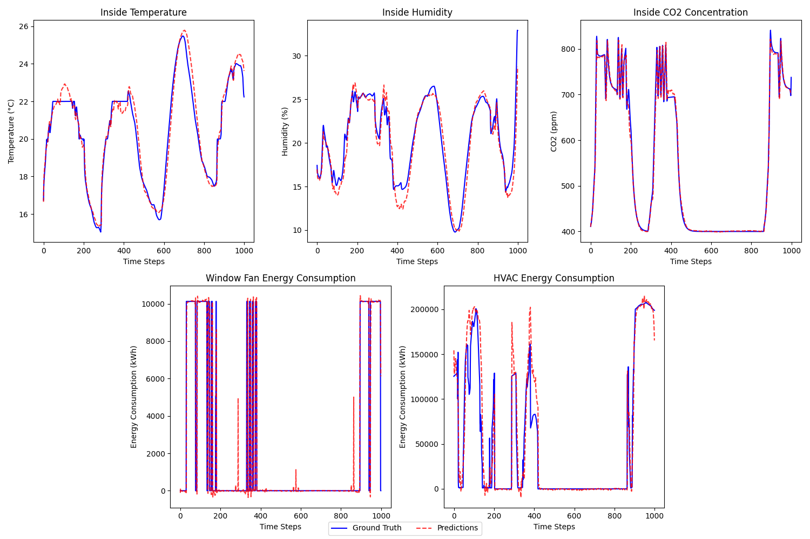

## Accelerating Reinforcement Learning for HVAC Systems Using an LSTM-based Simulator

This repository contains the implementation of an LSTM-based simulator designed to accelerate reinforcement learning for HVAC systems. The LSTM model is trained to replicate the behavior of the EnergyPlus simulator, reducing the need for costly I/O operations during RL training.

### 📂 Project Structure
- **`create_dataset.py`** – Collects simulation data using Sinergym and stores it in CSV files for different weather conditions and controllers.
- **`train_lstm.py`** – Trains the LSTM model to predict the next indoor state based on past observations, actions, and external conditions.
- **`test_lstm.py`** – Evaluates the trained LSTM model using rolling predictions.
- **`results.png`** – Visualization of evaluation results.

### 🔧 How to Use

#### 1️⃣ Data Collection
Run the following command to generate the dataset:
```bash
python3 create_dataset.py
```
This script will simulate different conditions using EnergyPlus via Sinergym and store the data in CSV files.

#### 2️⃣ Training the LSTM Model
Train the LSTM model using:
```bash
python3 train_all.py
```
This script uses different hyperparameters to optimize the model for predicting indoor conditions.

#### 3️⃣ Evaluating the Model
To evaluate the trained LSTM model:
```bash
python3 test_all.py
```
This script performs rolling predictions and compares them to EnergyPlus outputs.

### 📊 Results
Below is a sample result from our experiments:



